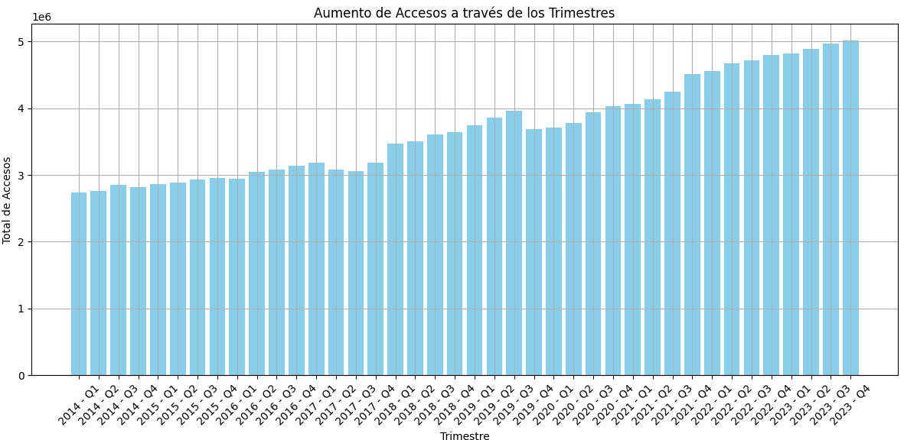

# Proyecto Individual 2 Henry: Telecomunicaciones

## Introducción
En este proyecto nos pusimos en la piel de un Analista de Datos contratado por una empresa en el área de Telecomunicaciones, específicamente orientada a proveer servicios de Internet. Se nos proporcionó un enlace oficial a la página del Ente Nacional de Comunicaciones (ENACOM), de donde tuvimos que descargar los archivos que nos parecieran relevantes para el análisis.

El cliente nos pidió un KPI inicial, pero no especificó la dirección del análisis. Rápidamente tenemos que iniciar un proceso de selección, debido a la importante cantidad de datos disponibles, tanto relevantes como desestimables, pero aún no conocemos la dirección en la que se va a profundizar el proyecto.

¡Siendo este un interesante desafío, manos a la obra!

## Índice
1. [Introducción](#introducción)
2. [Extracción, Carga y Transformación de los Datos (ETL)](#extracción-carga-y-transformación-de-los-datos-etl)
3. [Análisis Exploratorio de los Datos (EDA)](#análisis-exploratorio-de-los-datos-eda)
4. [Formulación de KPIs](#formulación-de-kpis)
5. [Producción del Dashboard](#producción-del-dashboard)
6. [Conclusión](#conclusión)

## Extracción, Carga y Transformación de los Datos (ETL)
Primero comenzaremos con la carga de los datos. Sin embargo, debido a la cantidad de posibles archivos a incluir y la falta de dirección inicial, se hará un pequeño análisis superficial a medida que se ingestan los datos con la intención de familiarizarnos con la información y el área de negocios. Se formaron una serie de gráficos simples con la intención de justificar las decisiones tomadas durante el proceso.

## Análisis Exploratorio de los Datos (EDA)
Una vez que tenemos los datos cargados y unificados, comenzamos con el análisis profundo, en el que intentamos buscar patrones e indicadores relevantes al análisis. También comenzamos los primeros pasos del cálculo de KPIs.

Dentro de este análisis se encontró la siguiente información:
- Argentina posee un buen nivel de penetración de Internet en la población, sin embargo, gran parte de esta está centrada en las grandes urbes y capitales, de entre las cuales destaca Capital Federal con un número de accesos superior al número de hogares.
- Provincias que tenían menor desarrollo como San Luis o Santa Cruz han tenido un crecimiento explosivo al comenzar a incorporar políticas de expansión de la red, y aún hay muchas otras provincias que no están al nivel del promedio de penetración nacional, por lo que está claro que el potencial de expansión está vigente.
- Las mayores mejoras en la calidad de la red han sido por las mejoras en las tecnologías, no solo generando nuevos accesos con tecnologías más modernas, sino reemplazando accesos anticuados como ADSL por los nuevos sistemas de Cablemodem y Fibra Óptica.

## Formulación de KPIs
Por todo lo nombrado en el análisis anterior, se propusieron los siguientes KPIs:

- Nuevos Accesos Cada 100 Hogares (N.A.C.H.): NACH es el nombre que propongo darle al KPI pedido por el cliente, con un aumento del 2% a nivel provincial que parece razonablemente fácil de lograr en zonas con menor nivel de acceso, pero bastante difícil en algunas provincias específicas que tienen un gran nivel de desarrollo. Es un KPI muy útil para medir el crecimiento bruto de la red.

- Coeficiente de Desigualdad de Penetración por Hogar (Co.De.P.H.): Como indicador de un correcto aprovechamiento de los posibles puntos de expansión y de progreso sostenible, propongo una disminución de 0.0025 puntos del CoDePH (Coeficiente de Desigualdad de Penetración en Hogares). Este KPI fue logrado aplicando un [Coeficiente de Gini](https://es.wikipedia.org/wiki/Coeficiente_de_Gini) sobre el número de accesos por cada 100 hogares en cada provincia, de manera que se pueda medir la distancia que hay entre cada una. Puede ser de excelente utilidad para asegurar un progreso equilibrado a lo largo y ancho del país, aprovechando al máximo todos los posibles puntos de expansión.

- Porcentaje de Red en Fibra Óptica (P.Re.F.O.): Se encontró una extrema relevancia y una relación casi directa entre la calidad de la red de internet (medida en media de bajada) y el aumento del porcentaje de fibra óptica en la red, por lo que me pareció un KPI muy útil, más tangible que el promedio de velocidad y menos dependiente de la solvencia económica del cliente.

## Producción del Dashboard
Una vez obtenidos los KPI necesarios, cargamos los datos en la herramienta de Business Intelligence de elección (en mi caso PowerBI) y comenzamos con la gráfica. Contamos con una portada simple y 3 páginas, una por KPI, con los gráficos más relevantes que tuvieron que ver con la producción de cada indicador.

## Conclusión
El proyecto ha sido una aventura interesante que ha puesto a prueba múltiples habilidades blandas de análisis sin perder de vista la práctica de habilidades técnicas. Considero que ha sido un éxito y que los insights conseguidos podrían ser muy valiosos para cualquier empresa del rubro.
